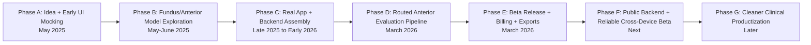
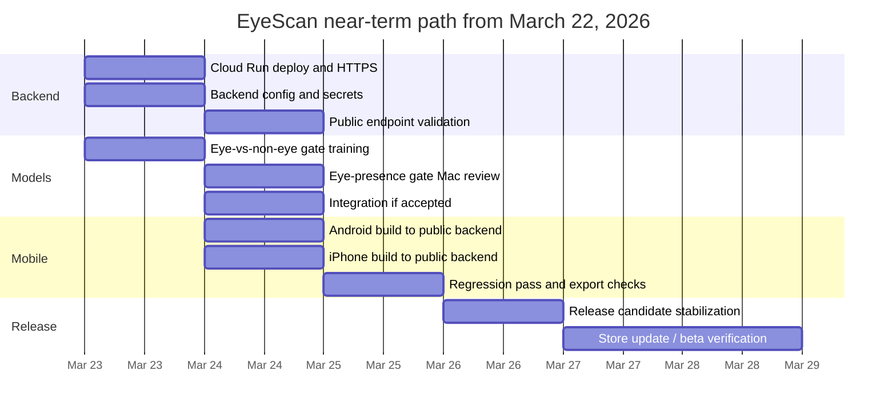

# EyeScan Progress Snapshot

Last updated: 2026-03-22 22:55 AEDT

## What this snapshot is

This file turns the old June 2025 ChatGPT-era roadmap into one current
source-of-truth snapshot that explains:

- where EyeScan started
- what actually got built
- what changed from the original plan
- where the project stands on 2026-03-22
- what the next practical delivery path looks like

Companion timeline files:

- `docs/EYESCAN_TIMELINE_2026.md`
- `docs/EYESCAN_TIMELINE_FROM_BEGINNING.md`

## Historical baseline from the original roadmap

The earliest structured roadmap we have in the shared timeline files was:

| Phase | Original window | Original status at the time |
| --- | --- | --- |
| Phase 1: UI + Mock Logic | 2025-05-17 to 2025-05-27 | Completed |
| Phase 2: Fundus Model Training | 2025-05-28 to 2025-06-10 | Training in Progress |
| Phase 3: Polish + Store Submission | 2025-06-14 to 2025-06-20 | Pending |
| Phase 4: Apple Vision Pro Release | 2025-07-08 to 2025-07-25 | Planned |
| Phase 5: Anterior Model Training | 2025-06-07 to 2025-06-17 | In Progress |
| Phase 6: Dual Model Integration | 2025-06-20 to 2025-06-25 | Upcoming |
| Bonus: Cloud Sync & Extras | 2025-07-26 to 2025-08-15 | Future |

Source artifact:

- `/Users/bharatsharma/Desktop/Eye_Scan App Timeline/Screenshots/EyeScan_Roadmap.csv`

## What the early ChatGPT-era work was really doing

The June 2025 screenshots show a project that was still heavily model-centric.
The main questions then were:

- which architecture to favor for mobile and Vision Pro
- how to train fundus and anterior models cleanly
- whether `Xception`, `InceptionV3`, `VGG16/19`, or lighter options were best
- how to structure the product roadmap around training milestones

That phase was useful because it established:

- the app roadmap discipline
- the mobile-first model thinking
- the difference between fundus and anterior-eye work
- the early belief that lightweight deployable models would matter

What changed later is that EyeScan stopped being just a training project and
became a real app-plus-backend product effort.

## What EyeScan actually became by 2026-03-22

EyeScan is no longer a single-model prototype. It is now a multi-part system:

1. Flutter mobile app for iPhone and Android
2. Python backend screening service
3. routed anterior-image evaluation pipeline
4. billing and clinic-access scaffolding
5. PDF export and saved-history workflow
6. shared handoff repo coordinating Mac, Dell, and Colab work

That is the biggest shift from the original 2025 roadmap.

## Major milestones that are now truly complete

### App and UX foundation

- core Flutter app exists and runs on iPhone and Android
- image capture and gallery review flows exist
- result screen, saved history, and PDF export exist
- branding refresh is in place:
  - symbol-only app icon
  - full `EyeScan / Eye Health AI` launch artwork

### Backend and screening pipeline

- local Python backend is working end to end for development
- `/health` endpoint exists
- routed anterior screening pipeline is live locally
- current integrated order is:
  1. `anterior_quality_gate_v1`
  2. `anterior_surface_binary_v2_simplecnn`
  3. `anterior_conjunctivitis_vs_normal_v1_simplecnn`
  4. `anterior_uveitis_vs_normal_v1_simplecnn`
  5. `anterior_pterygium_vs_normal_v1_simplecnn`
  6. `anterior_cataract_vs_normal_v1_simplecnn`

### Store and release groundwork

- Android billing scaffold is integrated
- Play subscription product `eyescan_plus` exists
- monthly and yearly base plans exist
- Android bundle versioning and 16 KB compliance work were addressed in later
  Mac threads
- iOS smoke builds succeeded locally

### Coordination and reproducibility

- shared Git handoff repo exists:
  `https://github.com/bharat2680/Eye-Scan-App-Shared---Handoff`
- Dell training work and Mac integration work are now coordinated there
- Colab notebook handoff has been preserved for VisionFM pilot work

## What changed from the original plan

### Original assumption

Train a few models, integrate them, polish the app, and release quickly.

### What reality required

The project expanded because real deployment needed more than model training:

- model packaging
- backend routing logic
- non-eye rejection
- public backend deployment
- real beta-build configuration
- billing and subscription alignment
- PDF/reporting polish
- better separation between demo mode and live screening

So the old roadmap was not wrong. It was just too optimistic for a real
medical-style product.

## Current truth on 2026-03-22

### What works now

- local iPhone screening works against the Mac backend
- PDFs export again
- demo mode is clearly separated from live backend mode
- non-eye rejection has improved via backend hardening
- the app can show narrower evaluation-only outputs like:
  - `Possible conjunctivitis pattern detected`
  - `Possible uveitis pattern detected`
  - `Possible pterygium pattern detected`
  - `Possible cataract pattern detected`

### What is still not solved

- public users cannot rely on the Mac LAN backend
- Android beta builds without `EYESCAN_BACKEND_URL` do not actually reach
  screening
- the current quality gate still is not the final long-term answer
- a dedicated `eye vs non-eye` gate is now needed
- the backend still needs public cloud deployment
- clinic-trial enforcement still needs backend logic

## Current risk picture

### Low risk

- Flutter UI iteration
- PDF layout changes
- additional specialist integration once packaged cleanly
- handoff and reproducibility

### Medium risk

- public backend deployment
- Android/iPhone release wiring to a hosted backend
- real-device beta testing across networks

### Higher risk

- clinical-grade generalization
- robust non-eye rejection across many false-positive object types
- durable backend architecture for long-term scale

## Updated project interpretation

The project has effectively moved through these real phases:

## Updated delivery path from today

The next path is no longer “train one more model and release.”

It is:

1. deploy backend to Google Cloud Run
2. point Android and iPhone builds to the public HTTPS backend
3. integrate the dedicated `anterior_eye_presence_gate_v1` if Dell packages it
4. retest non-eye rejection and PDFs across both platforms
5. finalize release candidate behavior for Android and iOS

## Realistic near-term timeline from 2026-03-22

## Plain-English summary

The original 2025 roadmap got EyeScan started, but the project has now crossed
into a much more serious stage. The main remaining work is not “make another
screen.” It is:

- public backend deployment
- cleaner rejection of non-eye images
- stable cross-device beta behavior
- release-quality wiring across Android and iPhone

That is a good sign. It means EyeScan has already moved beyond prototype
theory and into product hardening.

## Snapshot conclusion

As of 2026-03-22:

- EyeScan is no longer an idea-stage app
- EyeScan is no longer a single-model experiment
- EyeScan is now a functioning multi-part product in late beta-hardening
- the next true milestone is public-cloud deployment plus one better
  eye-presence gate
