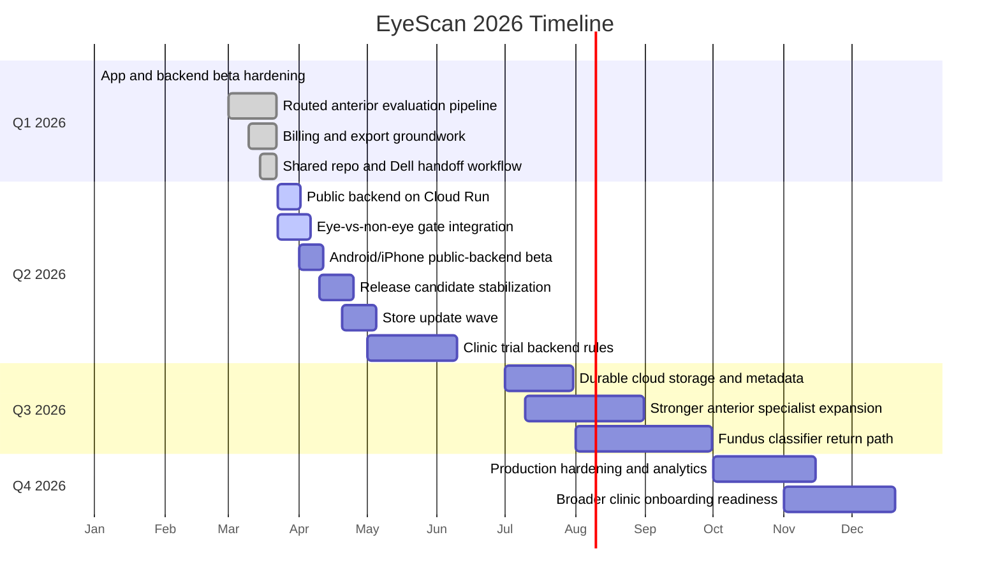

# EyeScan Timeline 2026

Last updated: 2026-03-22 23:40 AEDT

## What this file is

This is the current-year EyeScan timeline only. It is meant to answer one
simple question:

"What has happened in 2026 so far, and what is the most realistic path for the
rest of the year?"

## 2026 summary

2026 has been the year EyeScan moved from a promising prototype into a real
beta-hardening product effort. The biggest shifts were:

- moving from mock/demo logic to a live routed backend pipeline
- moving from single-model thinking to multiple specialist classifiers
- moving from local app testing to release, billing, and backend-hosting needs
- building real handoff structure across Mac, Dell, Colab, and shared Git

## 2026 year-to-date status

| Window | Status | Main outcome |
| --- | --- | --- |
| January 2026 | Completed | App/backend foundation kept evolving toward a usable beta workflow |
| February 2026 | Completed | Packaging, testing, and backend integration work continued |
| March 2026 | In progress | Local iPhone flow, Android beta, billing setup, PDFs, routed anterior pipeline, and shared repo coordination are all active |
| April 2026 | Planned | Public backend deployment, eye-vs-non-eye gate, cross-device beta stabilization |
| May-June 2026 | Planned | Cleaner Android/iOS release candidate and more reliable tester workflow |
| July-December 2026 | Tentative | Cloud persistence, clinic trial enforcement, stronger model routing, broader classifier expansion |

## 2026 timeline

## Current quarter interpretation

### Q1 2026

Most of Q1 was about turning EyeScan into a product that actually behaves like
an app-and-backend system rather than a training experiment. The biggest
completed outcomes are:

- local iPhone testing with live backend results
- Android beta packaging and billing groundwork
- multiple anterior specialist integrations
- improved non-eye rejection compared with earlier builds
- recovered PDF export flow

### Q2 2026

Q2 is now the critical delivery quarter. The most important milestones are:

1. public backend deployment
2. reliable tester access outside the home LAN
3. dedicated eye-presence / eye-vs-non-eye filtering
4. cleaner cross-device beta behavior
5. release-candidate stabilization for both Android and iOS

If those land, EyeScan moves from "works locally" to "works as a real beta."

## Plain-English forecast

### Best case

- Cloud Run deployment happens quickly
- Dell packages the eye-vs-non-eye classifier cleanly
- Android and iPhone both hit a real public backend
- release candidate is ready in Q2

### Most realistic case

- public backend and eye gate land first
- one more round of beta fixes follows
- durable clinic-trial/backend persistence comes after that

### Main blocker risk

The biggest remaining blocker is no longer UI polish. It is still deployment
and cross-network reliability.

## 2026 conclusion

2026 is the transition year where EyeScan stops being a promising prototype and
becomes a deployable product. The success metric for the rest of this year is
not "train the most models." It is:

- stable public backend
- reliable mobile beta across devices
- honest screening flow
- maintainable cloud-backed architecture
