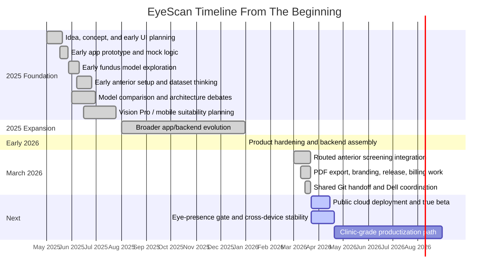

# EyeScan Timeline From The Beginning

Last updated: 2026-03-22 23:40 AEDT

## What this file is

This is the broad project timeline from the earliest structured EyeScan work to
the current state. It is meant to preserve the whole journey, not just the
current sprint.

## Big-picture arc

EyeScan started as a mobile eye-AI idea shaped around model selection and app
wireframes. Over time it evolved into:

- a Flutter mobile app
- a Python backend
- a routed anterior evaluation pipeline
- Android billing and release work
- iPhone testing and PDF export
- a shared handoff system across Mac, Dell, and Colab

That means the project history is better understood as several eras, not one
continuous simple roadmap.

## Master timeline

## Timeline by era

### Era 1: Idea and early roadmap phase

Approximate period:

- May 2025 to June 2025

What was happening:

- UI and product roadmap sketches
- early ChatGPT planning sessions
- dataset and architecture exploration
- focus on `Xception`, `InceptionV3`, `VGG16/19`, mobile suitability, and
  explainability tradeoffs

This was the "what should EyeScan become?" era.

### Era 2: Training-first expansion

Approximate period:

- mid 2025 through late 2025

What was happening:

- continued model experimentation
- stronger split between fundus and anterior ambitions
- broader app growth beyond pure mock logic

This was the "how do we train and prepare enough pieces?" era.

### Era 3: Product assembly

Approximate period:

- January 2026 to February 2026

What was happening:

- app structure matured
- backend became a real part of the system
- saved results and reporting became important
- release preparation became a real concern

This was the "turn it into a working product" era.

### Era 4: Routed anterior pipeline

Approximate period:

- March 2026

What was happening:

- quality gate plus surface router plus specialist classifiers
- local iPhone testing with real backend results
- Android beta and billing setup
- PDF export and branding improvements
- Dell + Mac + Colab handoff structure

This is the "late beta hardening" era we are in now.

### Era 5: Public deployment and operationalization

Approximate next period:

- late March 2026 onward

What still needs to happen:

- public backend on Google Cloud Run
- cloud storage / cloud SQL evolution
- better non-eye rejection with a dedicated eye-presence gate
- stable cross-network beta behavior
- clinic-trial enforcement

This will be the "real-world deployable product" era.

## Comparison: then versus now

| Topic | Early project view | Current project view |
| --- | --- | --- |
| Main challenge | Choosing the right model | Making the whole system deployable and reliable |
| Delivery assumption | Train models, integrate, release soon | App, backend, routing, deployment, billing, and testing all matter |
| App role | Mostly shell for AI | Real product surface with exports, billing, history, and configuration |
| Backend role | Secondary or implied | Essential part of the current screening flow |
| Beta readiness | Mostly model-driven | Infrastructure-driven |

## Whole-project conclusion

From the beginning to now, EyeScan has gone through three major upgrades in
identity:

1. from concept to prototype
2. from prototype to app-plus-backend system
3. from app-plus-backend system to late-stage beta product

That is why the project looks very different from the earliest 2025 roadmap.
The project did not drift randomly. It matured.
